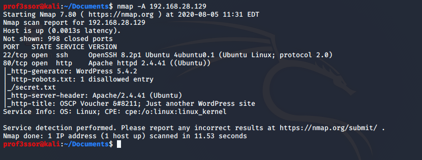
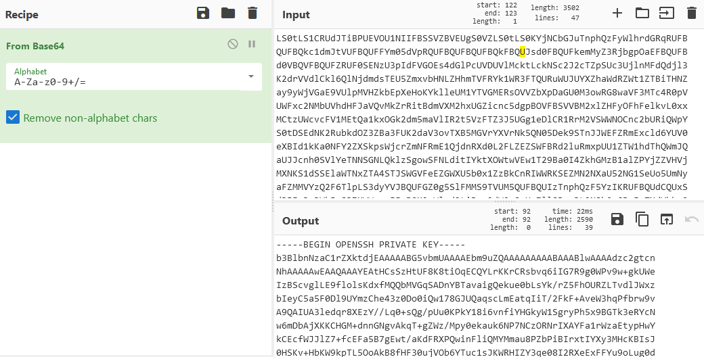
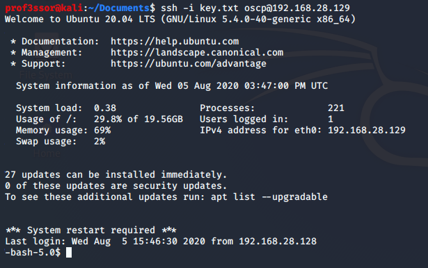
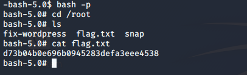
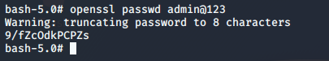
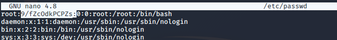
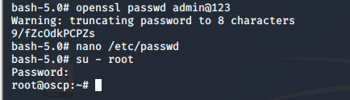

# Infosec Prep: OSCP
#### Once we start OS in VM we get the IP address by DHCP.

#### Now we start Recon by scanning with nmap 

`nmap -A 192.168.28.129`
 ## Information Gathering: 
 ##### Nmap scan output says that, `22/tcp ssh` is opened and `80/tcp http` is opened. In `robots.txt`, secret.txt is disallowd entry

##### We opened `http://192.168.28.129/secret.txt/`
On that page we get encrypted msg. so we try to decrypt it with **base64**

Here we get that openssh private key.
so now try to login with ssh + ssh key.
given key save with a any file name.

`ssh -i key.txt oscp@192.168.28.129`

`/bin/bash -p`

this will give root previledges. so **flag** is here

Now try to gain **root** password

`openssl passwd admin@123`
 
below generated output copy and paste to `/etc/passwd` file

copied string replace with `x` 

[Click here for more Privilege Escalations about this box](https://medium.com/@falconspy/infosec-prep-oscp-vulnhubwalkthrough-a09519236025)