# Traceback
## Recon:
`sudo nmap -T4 -O -A -sV -p- -sS -Pn -n -vvv -oA scan1 10.10.10.181`
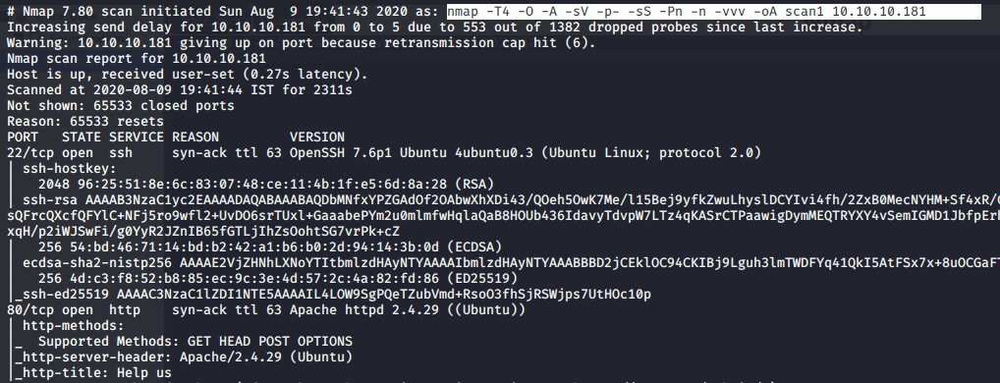

According to Nmap scan results, Port no `22 tcp/ssh` , `80 tcp/http`

## Enumeration
Open 80 port in browser
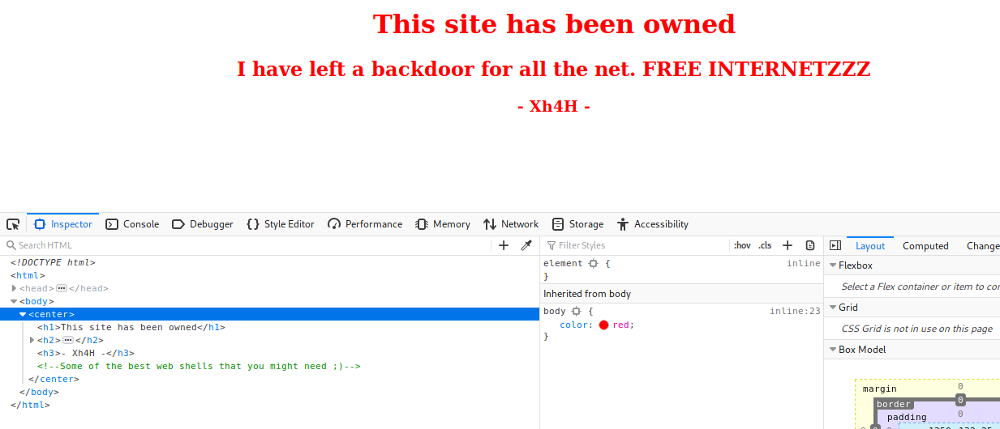
 *Some of the best web shells that you might need ;)*

 we google the above hint and get the github link. https://github.com/TheBinitGhimire/Web-Shells
 
 github link displays a php web shells as follow
 
 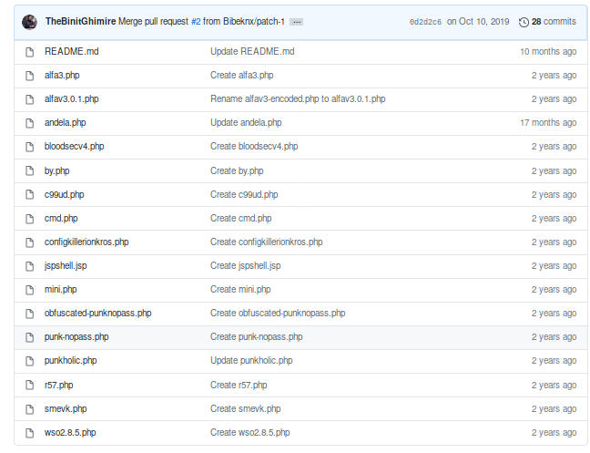
 
 Collect all these names and try to directory search with it. Finally get `smevk.php`
 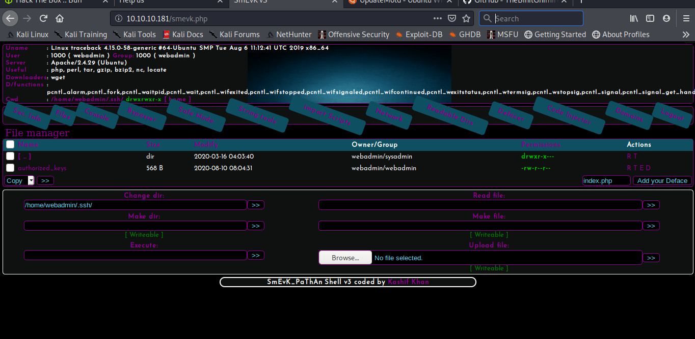
 
 using console we moved to the `/home/webadmin/.ssh/`
 and remove the `authorized_key` file

 **on kali:**
 `ssh-keygen` > generated ssh keys.
`mv id.rsa.pub authorized_keys `
`cp authorized_keys ../Downloads`

we done password less authentication between webadmin user and kali user by uploading `authorized_keys`.

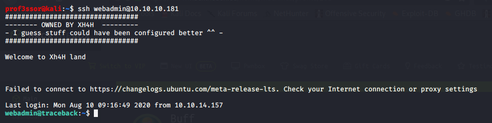
ssh authentication successfull..

### Previledge Escalation
`sudo -l`
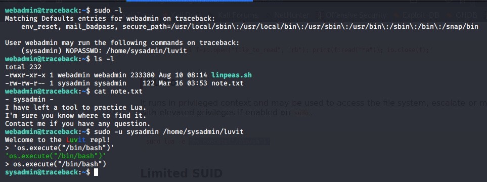
logged in user have the permission to `/home/sysadmin/luvit`

we use a *lua binary* for previledge escalation.
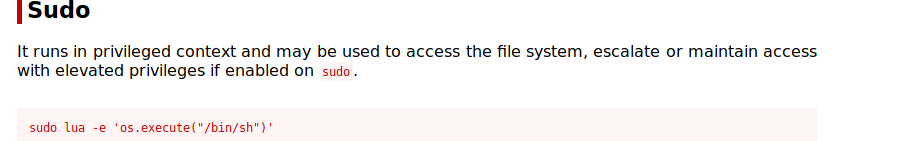
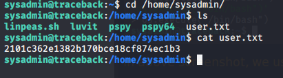
Here we get the user flag

`python3 -m http.server` - setup the webserver on kali machine to wget the file
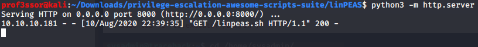

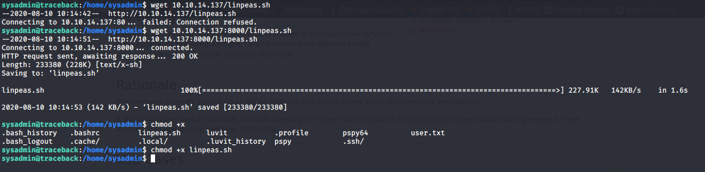
Run the linpeas.sh script

here we got some interesting..!!!
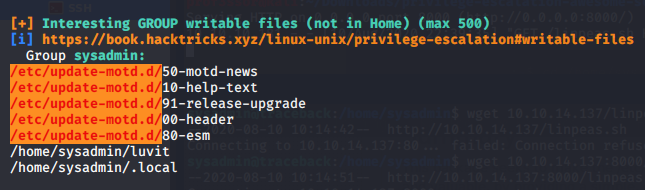
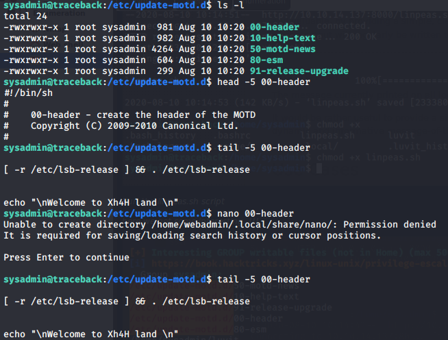
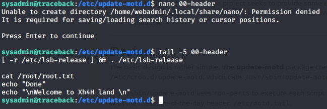
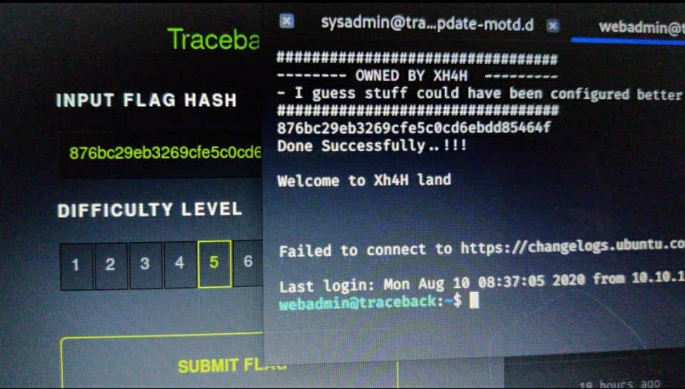
flag is here..!!